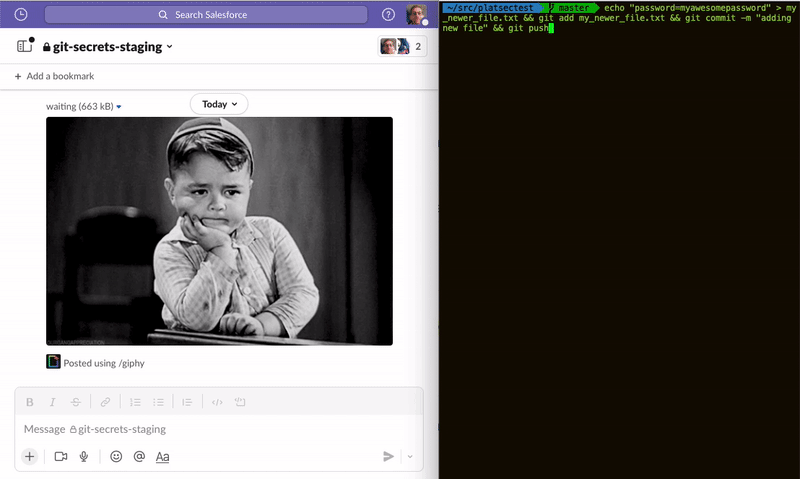

# Lobster Pot

## Demo

## Purpose

The purpose of this software is to scan all code pushed into one or more Github Organisations, to search for secrets, and report to Slack any findings.

It has been originally created by [Etienne Stalmans](https://github.com/staaldraad) and has been maintained and updated by the Platform Security Team.

It is actively used in various Github organisations under the Salesforce Enterprise plan.

It has been primarily designed to run on Heroku, but can be used on any platform that supports [12factor apps](https://12factor.net/).

## Monitoring of a GitHub Org

The app receives push event notifications from GitHub. Each push is reviewed and the commits within are scanned for possible secrets (such as passwords, AWS secret keys, API tokens etc).  
When the scanning reveals findings, the application posts a message to a defined slack channel with the relevant details and triggers a manual review.  
Those findings are also stored in the database for stats and reporting purposes.

## Components

### Backend

The backend is written in [Go](https://golang.org/), and is running on [Heroku](https://www.heroku.com/) or any platform that supports [12factor apps](https://12factor.net/). The detailed configuration is documented in the  [docs/configuration](docs/configuration) folder.

### Github Apps

A Github App is installed in each organisation that is monitored. It provides organisation level webhooks, to send all push events to our app. The specific configuration can be found [here](docs/configuration/github_apps.md).

### Slack Apps

A Slack app is installed in each Slack workspace in order to send notifications to the workspace. The specific configuration can be found [here](docs/configuration/slack.md).

## Setup

See the [docs/configuration](docs/configuration) folder for the specifics.

At least one github organization and one slack app must be configured for the app to start properly.
